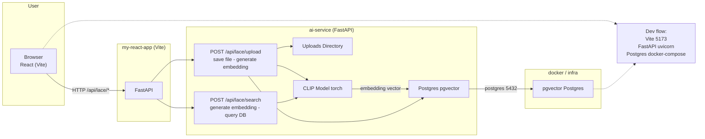

```mermaid
graph LR

subgraph User
    Browser["Browser<br/>React (Vite)"]
end

subgraph Frontend["my-react-app (Vite)"]
    Browser -->|HTTP /api/lace/*| API["FastAPI"]
end

subgraph Backend["ai-service (FastAPI)"]
    API --> Upload["POST /api/lace/upload<br/>save file - generate embedding"]
    API --> Search["POST /api/lace/search<br/>generate embedding - query DB"]

    Upload --> Storage["Uploads Directory"]
    Upload --> CLIP["CLIP Model torch"]
    Search --> CLIP
    CLIP -->|embedding vector| DB["Postgres pgvector"]
    Upload --> DB
end

subgraph Infra["docker / infra"]
    DB -->|postgres 5432| PG["pgvector Postgres"]
end

Note["Dev flow:<br/>Vite 5173<br/>FastAPI uvicorn<br/>Postgres docker-compose"]

Browser -.-> Note
PG -.-> Note
```
